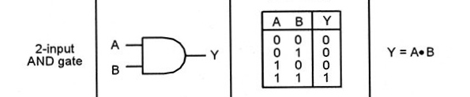
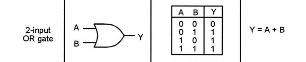
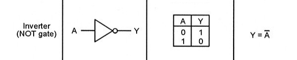

Unit -1

# 1. What is number system ? Describe all the number system with example

Answer:
The number system is the system of naming or representing numbers. There are various types of number systems in maths like binary, decimal, etc.The value of these numbers depend on the position of the number.

### Binary number system:
+ Consist of 0 and 1
+ Have a base of 2
+ ex: 101 ,(101)2

### Decimal number system:
+ Consist of 0,1,2,3,4,5,6,7,8,9
+ Have a base of 10
+ ex: 14, (15)10

### Octal  number system:
+ Consist of 0,1,2,3,4,5,6,7
+ Have a base of 8
+ ex: 14, (15)8

### Hexadecimal number system:
+ Consist of 0,1,2,3,4,5,6,7,8,9,A(10),B(11),C(12),D(13),E(14),F(15)
+ Have a base of 16
+ ex: AF, (15A)16

# 2. Conversion of decimal number to binary number,hexadecimal number and octal number.

Answer:
### How to convert decimal to binary
Conversion steps:
1. Divide the number by 2.
1. Get the integer quotient for the next iteration.
1. Get the remainder for the binary digit.
1. Put the bits in reverse high to low order.

ex: 5= 101 or (101)2
| Division by 2 | Quotient | Remainder | Bit |
|---------------|----------|-----------|-----|
| 5/2           | 2        | 1         | 0   |
| 2/2           | 1        | 0         | 1   |
| 1/2           | 0        | 1         | 2   |

### How to convert decimal to Octal
Conversion steps:
1. Divide the number by 8.
1. Get the integer quotient for the next iteration.
1. Get the remainder for the binary digit.
1. Repeat the steps until the quotient is equal to 0
1. Put the bits in reverse high to low order.

ex: 13= 15 or (15)8
| Division by 8 | Quotient | Remainder | Bit |
|---------------|----------|-----------|-----|
| 13/8          | 1        | 5         | 0   |
| 1/8           | 0        | 1         | 1   |

### How to convert decimal to Hexadecimal
Conversion steps:
1. Divide the number by 16.
1. Get the integer quotient for the next iteration.
1. Get the remainder for the binary digit.
1. Repeat the steps until the quotient is equal to 0
1. Put the bits in reverse high to low order.

ex:20 = 14 or (14)16
| Division by 16 | Quotient | Remainder | Bit |
|----------------|----------|-----------|-----|
| 20/16          | 1        | 4         | 0   |
| 1/16           | 0        | 1         | 1   |

# 3. What is boolean algebra & the boolean variable have how many possible value.

Answer:
Boolean algebra is the branch of algebra in which the values of the variables are true and false, usually denoted 1 and 0, respectively.

# 4. Logic gate explain all the logic gates along with its block diagram and truth table.

Answer:
Logic gates are the basic building blocks of any digital system. It is an electronic circuit having one or more than one input and only one output. The relationship between the input and the output is based on a certain logic. Based on this, logic gates are named as *AND* gate, *OR* gate, *NOT* gate .

### AND Gate
A circuit which performs an AND operation is shown in figure. It has n input (n >= 2) and one output.
Only returns true if both values are true.

### OR Gate
A circuit which performs an OR operation is shown in figure. It has n input (n >= 2) and one output.
Only returns true if 1 or both of the values are true

### NOT Gate
NOT gate is also known as Inverter. It has one input A and one output Y.It reverses the input value i.e. true to false, false to true.

# 5. What is tristate buffer ?

# 6. What is the difference between sop and pos?

# 7. 0,1,3,5,6,7,8 minimize this boolean function by using k-map.

# 8. Fs=a•b•c+a'•b•c'+a•b•c draw the logic circuit for above boolean function.

# 9. Synthesization  with nand and nor gate F= a•b+a'•b+a'b'

# 10. What is universal nand gate and nor gate?

# 11. Pie of 1,2,3 6,7,8 11,13,15 minimize this logic expression using pos.
