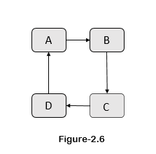

# 19/01/22

## Graph Theory

+ A graph is pictorial reprentation of any data in organized manner.

+ The graph shows the relation between variable quantities.

+ the graph is made up of vertices (nodes) that are connected by the edges (lines).

```

┌───┐                     ┌───┐
│ A ├─────────────────────┤ B ├───►  Nodes
└─┬─┘                     └─┬─┘
  │                         │
  │                         │
  │                         │
  │                         │
  │                         │
  │                         │◄────── Edges
  │                         │
  │                         │
  │                         │
  │                         │
┌─┴─┐                     ┌─┴─┐
│ D ├─────────────────────┤ C │
└───┘                     └───┘
 
 figure-1
```

+ Famous Swiss mathematician **Leonhard Eular** invented Graph theory. " *with grapes we can minimise various complex math problems* ".

+ A graph is denoted by **G(V,E)** , where
  + **G = Graph**
  + **V = Vertices**
  + **E = Edges**

### Types of Graphs by Edge direction

+ Graphs are divided into two types
  1. Directed graphs
  2. Undirected graphs

1. Directed graphs

+ A directed graph is a graph made up of a set of vertices connected by ages in which the ages have direction.
+ It's a unidirectional graph.

```

┌───┐                  ┌───┐
│ A └─────────────────►│ B │
└───▲                  └───┘
    \                   /
     \                 /
      \               /
       \             /
        \           /
         \         /
          \       /
       \     /
            ┌───▼
            │ C │
            └───┘

    figure-2.0
```

2. Undirected Graph

+ A directed graph is a graph made up of a set of vertices connected by edges in which the edges are bidirectional.

```

┌───┐                   ┌───┐
│ A ├───────────────────┤ B │
└───┘                   └───┘
     \                   /
      \                 /
       \               /
        \             /
         \           /
          \         /
           \       /
     \     /
             ┌───┐
             │ C │
             └───┘

     figure-2.1
```

### Types of Graphs

1. [Null graph](###-null-graph)
2. [Simple graph](###-simple-graph)
3. [Multi graph](###-multi-graph)
4. [Connected and Disconnected graph](###-connected-and-disconnected-graph)
5. [Cycle graph](###-cycle-graph)

---

### Null Graph

+ A graph that doesn't have any edges is called a Null graph.


```
figure-2.2
```

### Simple graph

+ A graph that is undirected, doesn't have any loops & multiple paths between the vertices is called a Simple graph.


```
figure-2.3
```

### Multi graph

+ A graph with multiple edges between the same set of vertices and if it has loop then we call it a Multi graph.


```
figure-2.4
```

### Connected and Disconnected graph

+ Whether the vertices of the graph are connected or not the decides if it is a Connected graph or Disconnected graph.


```
figure-2.5
```

### Cycle graph

+ A graph which from a cycle is called as a cycle graph, where it has a single cycle.

+ When the graph ends up as the same node it started it's called a cycle graph.



```
figure-2.6
```

[Null graph]:[ng]