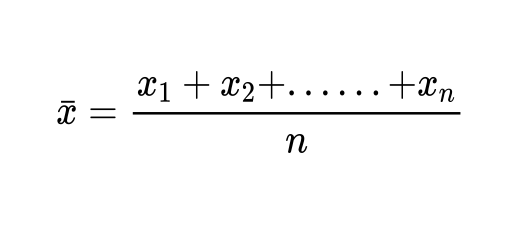
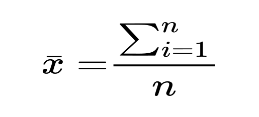

# Measurement of Central Tendency
- Mean
- Mode
- Median
  
## Mean:
- A.M (*Arithmetic*)
- G.M (*Geometric*)
- H.M (*Harmonic*)
- W.M (*Weighted*)
  
### A.M:
> *Case -1:* RAW Type data :-

let <var>x1 ,x2 ...........xn</var> are the *n* number of data.

then 

<!--     Latex formule for it
$$
\bar{x} = \frac{x_1 + x_2 + ......+x_n}{n}
$$
-->

> OR

<!--   Latex formule for it
$$
\bar{x} = \frac{\sum^{n}_{i=1}}{n}
$$
-->

    example:
        5,7,9,10,15 find mean

$$
\bar{x} = \frac{5+7+9+10+15}{5}= \frac{45}{5} = 9.2
$$

---

> *Case -2:* Frequency type data

- Frequency = no. of times

let <var>x1 ,x2 ...........xn numbers having f1 ,f2 ...........fn</var> be coresponding frequencies

| $x$ | $f$ | $xf$ |
|-----------------|-----------------|------------------|
|      $x_1$      |      $f_1$      |     $x_1 f_1$    |
|      $x_2$      |      $f_2$      |     $x_2 f_2$    |
|      $x_3$      |      $f_3$      |     $x_3 f_3$    |
|       $.$       |       $.$       |        $..$      |
|       $.$       |       $.$       |        $..$      |
|      $x_n$      |      $f_n$      |     $x_n f_n$    |

> *formula* :

$$
\bar{x} = \frac{x_1 f_1+ x_2 f_2+ ......+x_n f_n}{n}
$$

> OR

$$
\bar{x} = \frac{\sum^{n}_{i=1} fi xi}{\sum^{n}_{i=1} fi}
$$

  

    example:
        find x bar in following data

  

| x   | f | xf |
|-----|---|----|
| 5   | 3 | 15 |
| 7   | 4 | 28 |
| 8   | 5 | 40 |
| 9   | 2 | 18 |
| 10  | 1 | 10 |
| 15  | 2 | 30 |
|-----|---|----|
|total|17 | 141|

  

$$
\bar{x}=\frac{\sum fx}{\sum f}=\frac{141}{17}=8.29
$$

  

> *Case -3*: Interval / Group type data

- 2 types

    - **Continuous type of data**
    - **Discontinuous type of data**

### Continuous type of data

x1---x2 1st interval  
x2---x3 2nd interval  
x3---x4 3rd interval  
x4---x5 4th interval  
.......................................  
.......................................  
xn-1---xn n th interval  

  

> example :

| x     |
|-------|
|5---10 |
|10---15|
|15---20|
|20---25|

***Here xn -> upper limit of the 1st interval = lower limit of the 2nd interval***

> ***size of class  x2 - x1***

here class size = 10 - 5 = 5

Let <var>x1-x2,
x2-x3 --- xn-1 - xn</var> be the interval type of data having <var>f1, f2, f3, f4--- fn </var>

  

> formule:

| x               | f         | M(middle value)               | fM          |
|-----------------|-----------|-------------------------------|-------------|
| $x_1 - x_2$     | $f_1$     | $\frac{x_1 + x_2}{2} = m_1 $  | $f_1 m_1$   |
| $x_2 - x_3$     | $f_2$     | $\frac{x_2 + x_3}{2} = m_2 $  | $f_2 m_2$   |
| $x_3 - x_4$     | $f_3$     | $\frac{x_3 + x_4}{2} = m_3 $  | $f_3 m_3$   |
| $x_{n-1} - x_n$ | $f_n$     | $\frac{x_{n-1} +x_n}{2}=m_n $ | $f_n m_n$   |
|                 | $\sum fi$ |                               | $\sum fiMi$ |

  

$$
\bar{x}=\frac{f_1 M_1+f_2 M_2+f_3 M_3...+f_n M_n}{f_1+f_2+f_3...+f_n}
$$

 

$$
\bar{x}=\frac{\sum fiMi}{\sum fi}
$$

> example:

| x       | f |
|---------|---|
| 5---10  | 2 |
| 10---15 | 3 |
| 15---20 | 2 |
| 20---25 | 4 |
| 25---30 | 1 |

> ans:

| x       | f |         M         | fM    |
|---------|---|-------------------|-------|
| 5---10  | 2 | (5+10)/2  = 7.5   | 13    |
| 10---15 | 3 | (10+15)/2 = 12.5  | 37.5  |
| 15---20 | 2 | (15+20)/2 = 17.5  | 35    |
| 20---25 | 4 | (20+25)/2 = 22.5  | 90    |
| 25---30 | 1 | (25+30)/2 = 25.5  | 25.5  |
|       |12 |                   | 205.0 |

$$
\bar{x}=\frac{\sum fM }{\sum f} = \frac{ 205 }{12} =17.083 
$$

- try keeping precision to 3

### Discontinuous type of data

| x               | f      |
|-----------------|--------|
| $x_1 - x_2$     | $f_1$  |
| $x_2 - x_3$     | $f_2$  |
| $x_5 - x_6$     | $f_3$  |
| $x_{n-1} - x_n$ | $f_n$  |

> Discontinuous type data must be converted to continuous type  
> which means to introduce an ***Adjusting Factor***  
> Then it should subtract from **lower** limit and add to the **upper** limit

$$
AF = \frac{x_3 - x_2}{2}
$$

> example: 

| x     | f |
|-------|---|
| 6---10  | 2 |
| 11---15 | 3 |
| 16---20 | 1 |
| 21---25 | 2 |
| 26---30 | 3 |

> Af = (11-10)/2 = 0.5 // (lower limit of the 2nd interval - upper limit of the 1st interval)/2

| x     | f | x         |         M          | fM  |
|-------|---|-----------|--------------------|-----|
| 6---10  | 2 | 5.5-10.5  | (5.5+10.5)/2  = 8  | 16  |
| 11---15 | 3 | 10.5-15.5 | (10.5+15.5)/2 = 13 | 39  |
| 16---20 | 1 | 15.5-20.5 | (15.5+20.5)/2 = 18 | 18  |
| 21---25 | 2 | 20.5-25.5 | (20.5+25.5)/2 = 23 | 46  |
| 26---30 | 3 | 25.5-30.5 | (25.5+30.5)/2 = 28 | 84  |
|       |11 |           |                    | 203 |

$\bar{x}= \frac{203}{11}= 18.454$

## Shortcut Method :

> RAW Type Data :

x1, x2, x3...........xn with n no. of data

> a = assumed mean
> d = xi - a

$$\bar{x}= a + \frac{\sum d}{n}$$

    example:
        5, 7, 9, 11, 13, 15 find x bar with shortcut method

> Ans:

5, 7, 9, 11, 13, 15 // take an assumption of the minimum average

let a = 11

|  x | a  | d=x-a |
|----|----|-------|
| 5  | 11 |  -6   |
| 7  | 11 |  -4   |
| 9  | 11 |  -2   |
| 11 | 11 |   0   |
| 13 | 11 |   2   |
| 15 | 11 |   4   |

  

$\sum d = -6$

 

$\bar{x} = a + \frac{\sum d}{n}$

   $= 11 + \frac{-6}{6}$

   $= \frac{66-6}{6}$

   $= \frac{60}{6}$

   $= 10$

$\bar{x} = 10$
